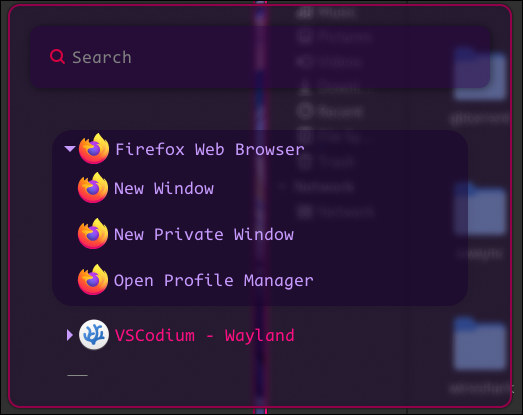
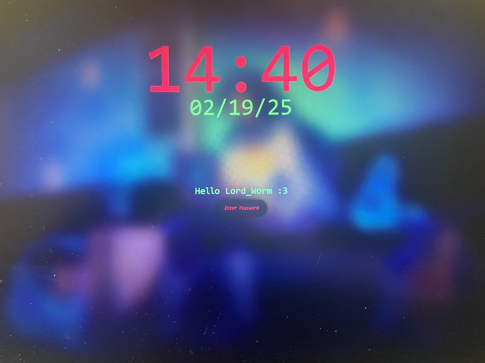
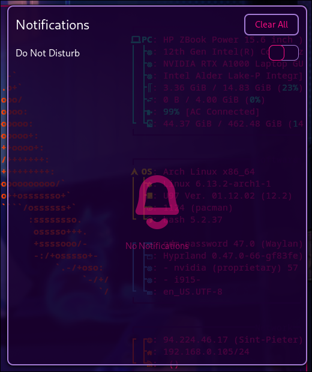
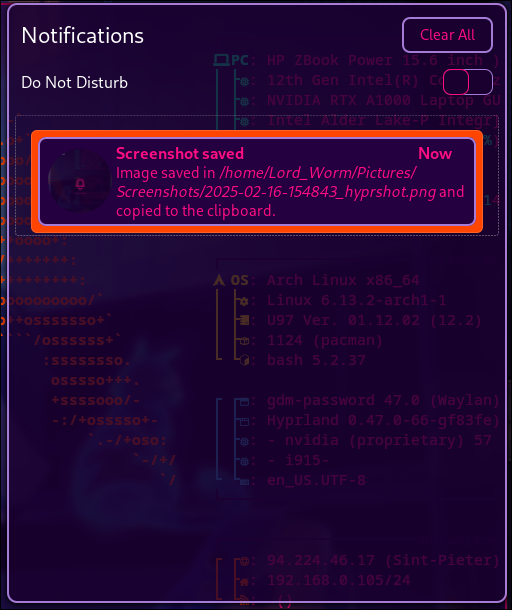
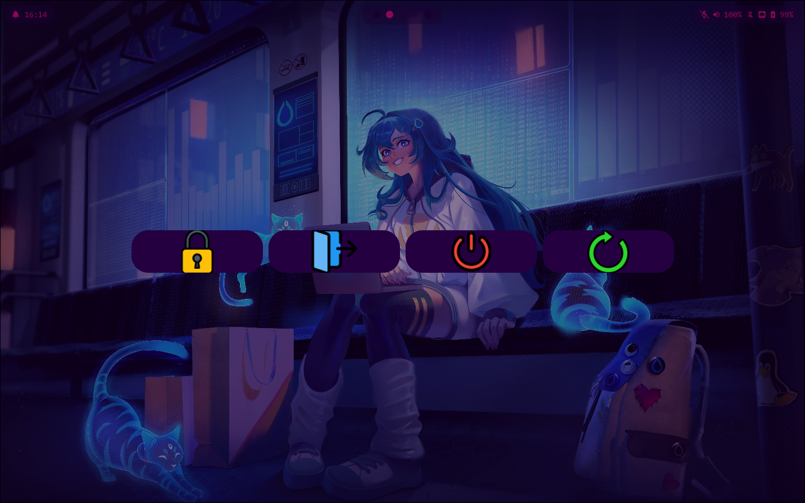

# Wildberries-Ports

Wildberries theme ports on applications I use, the theme was originally created by Gabo: https://github.com/gbgabo and can be found on www.wildberries.style website

Waybar, wofi and hyprlock were originally made by https://github.com/elifouts at https://github.com/elifouts/Dotfiles but were modified to match the wildberries style colors and my preferences

Swaync was made by https://github.com/MrRoy shared at https://github.com/ErikReider/SwayNotificationCenter/discussions/183 and was modified to match the theme colors

Wlogout was made by https://github.com/gfhdhytghd at https://github.com/gfhdhytghd/wlogout-theme and again was modified by me to match the functionality and the colors I wanted

Please find the attached pictures to see how they look like and read all the readme.txt files for more info
