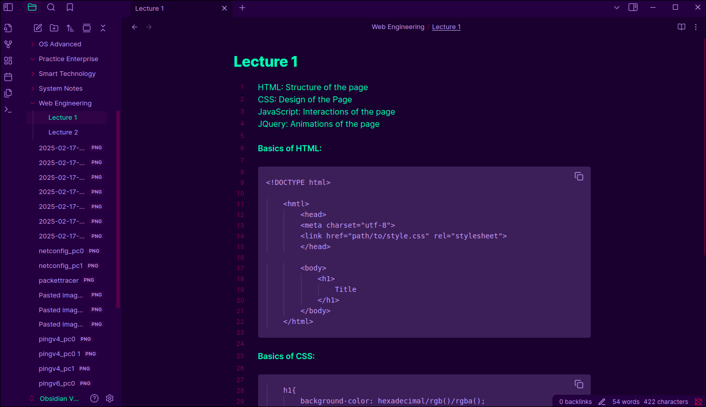
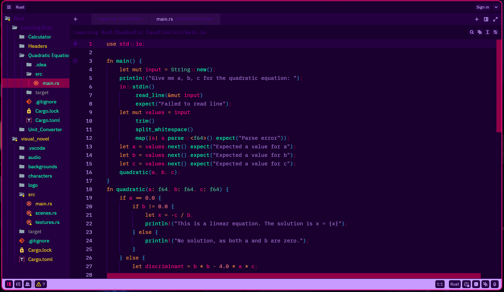
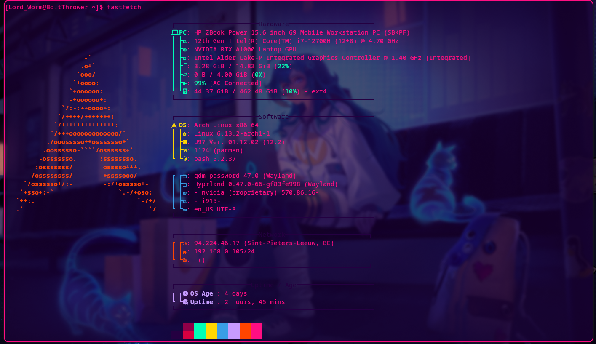
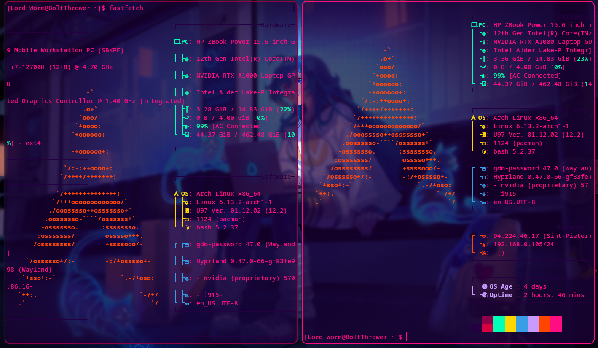

# Wildberries-Ports

Wildberries theme ports on applications I use, the theme was originally created by Gabo: https://github.com/gbgabo and can be found on www.wildberries.style website

Waybar, wofi and hyprlock were originally made by https://github.com/elifouts at https://github.com/elifouts/Dotfiles but were modified to match the wildberries style colors and my preferences

Swaync was made by https://github.com/MrRoy shared at https://github.com/ErikReider/SwayNotificationCenter/discussions/183 but again moified to match the theme colors

Wlogout was made by https://github.com/gfhdhytghd at https://github.com/gfhdhytghd/wlogout-theme and again was modified by me to match the functionality and the colors I wanted

Obsidian was made by someone else's base source that I cannot find if you see that this is your modifed code please contact me and I'll give you proper credit

Zed was made with the help of an anonymous user that used the Official theme-importer script of the dev build of Zed that my computer could not build due to errors massive thanks to said user, further modifications were made as it was not perfect from the get-go as I needed to fix a few color inconsistencies 

kitty and hyprland were made by me

Please find the attached pictures to see how they look like and read all the readme.txt files for more info
